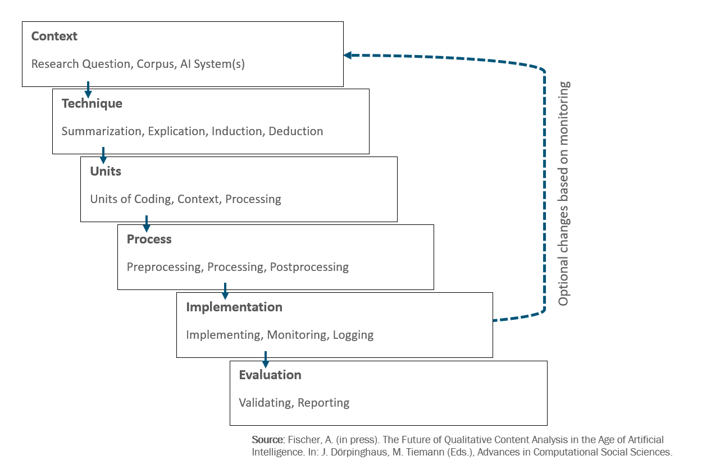

[[DE]](README_de.md)/[[EN]](README.md)

# AI-based content analysis

With a view to [The Future of Qualitative Content Analysis in the Age of Artificial Intelligence](https://www.f-bb.de/unsere-arbeit/publikationen/die-zukunft-der-qualitativen-inhaltsanalyse-im-zeitalter-kuenstlicher-intelligenz-ein-ablaufmodell), this repository collects references with information and materials on AI-based content analysis according to [Fischer (2025)](https://www.f-bb.de/unsere-arbeit/publikationen/die-zukunft-der-qualitativen-inhaltsanalyse-im-zeitalter-kuenstlicher-intelligenz-ein-ablaufmodell).

For regular exchanges on this topic, please refer to the Community of Practice [#CoP_KIPerWeb](https://github.com/AndreasFischer1985/KIPerWeb?tab=readme-ov-file#termine).  There, we develop tools on the topic (e.g., [MyQDA](https://andreasfischer1985.github.io/code-snippets/html/MyQDA.html)) and you will also find introductory materials and code examples on how to perform [AI-based content analysis in R](https://github.com/AndreasFischer1985/KIPerWeb/blob/main/cop/slides/250919-35-CoP_KIPerWeb.pdf). For the digitally sovereign and data protection-compliant use of open-weights AI on your own hardware (“on premises”), please refer to our [code snippets](https://github.com/AndreasFischer1985/code-snippets).

## Further information

* [Fischer, A. (2025). Die Zukunft der Qualitativen Inhaltsanalyse im Zeitalter Künstlicher Intelligenz. Ein Ablaufmodell KI-basierter Inhaltsanalyse. f-bb-online 03/25.](https://www.f-bb.de/unsere-arbeit/publikationen/die-zukunft-der-qualitativen-inhaltsanalyse-im-zeitalter-kuenstlicher-intelligenz-ein-ablaufmodell/)
* Fischer, A. (in press). The Future of Qualitative Content Analysis in the Age of Artificial Intelligence in M. Tiemann & J. Dörpinghaus (Eds.), Advances in Computational Social Sciences.
* [Fischer, A., Sebesta, V., Schmitt, M., Hecker, K. (2026). KI-basierte Inhaltsanalyse von Stellenanzeigen der Automobilindustrie. Zeitschrift für Arbeitswissenschaft, 80(1):37-50.](https://www.researchgate.net/publication/400250302_KI-basierte_Inhaltsanalyse_von_Stellenanzeigen_der_Automobilindustrie) 
* [Fischer, A. & Schley, T. (2026). KI-basierte qualitative Inhaltsanalyse von Lernstandsdokumentationen zur Reflexion und Gestaltung beruflicher Bildung. H. Ertl,  M. Baum, T. Padur, M. Schlieker, B. Rödel, (Hrsg.): KI in der beruflichen Bildung – wie könnenwir die Zukunft gestalten? (pp. 31-44). BIBB: Bonn. DOI: 10.66390/JKCM2608](https://lit.bibb.de/vufind/Record/DS-784808)
* tba... 

