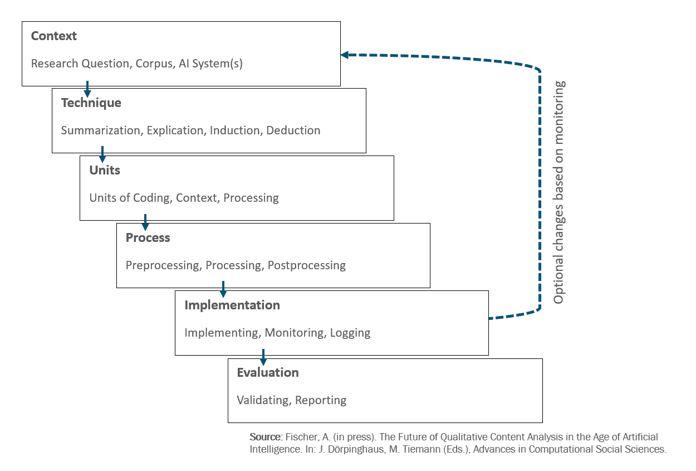

[[DE]](README.md)/[[EN]](README_en.md)

# AI-based content analysis

With a view to [[The Future of Qualitative Content Analysis in the Age of Artificial Intelligence]](https://www.f-bb.de/unsere-arbeit/publikationen/ the-future-of-qualitative-content-analysis-in-the-age-of-artificial-intelligence-a-process-model/), this repository collects references with information and materials on AI-based content analysis according to [[Fischer (2025)]](https://www.f-bb.de/unsere-arbeit/publikationen/ die-zukunft-der-qualitativen-inhaltsanalyse-im-zeitalter-kuenstlicher-intelligenz-ein-ablaufmodell/).

For regular exchanges on this topic, please refer to the Community of Practice [[#CoP_KIPerWeb]](https://github.com/AndreasFischer1985/KIPerWeb?tab=readme-ov-file#termine).  There, we develop tools on the topic (e.g., [[MyQDA]](https://andreasfischer1985.github.io/code-snippets/html/MyQDA.html)) and you will also find introductory materials and code examples on how to perform [[AI-based content analysis in R]](https://github.com/AndreasFischer1985/KIPerWeb/blob/main/cop/slides/250919-35-CoP_KIPerWeb.pdf). For the digitally sovereign and data protection-compliant use of open-weights AI on your own hardware (“on premises”), please refer to our [[code snippets]](https://github.com/AndreasFischer1985/code-snippets).

## Further information

* [[Fischer, A. (2025). Die Zukunft der Qualitativen Inhaltsanalyse im Zeitalter Künstlicher Intelligenz. Ein Ablaufmodell KI-basierter Inhaltsanalyse. f-bb-online 03/25.]](https://www.f-bb.de/unsere-arbeit/publikationen/die-zukunft-der-qualitativen-inhaltsanalyse-im-zeitalter-kuenstlicher-intelligenz-ein-ablaufmodell/)

* Fischer, A. (im Druck). Fischer, A. (im Druck). The Future of Qualitative Content Analysis in the Age of Artificial Intelligence in M. Tiemann & J. Dörpinghaus (Eds.), Advances in Computational Social Sciences.

